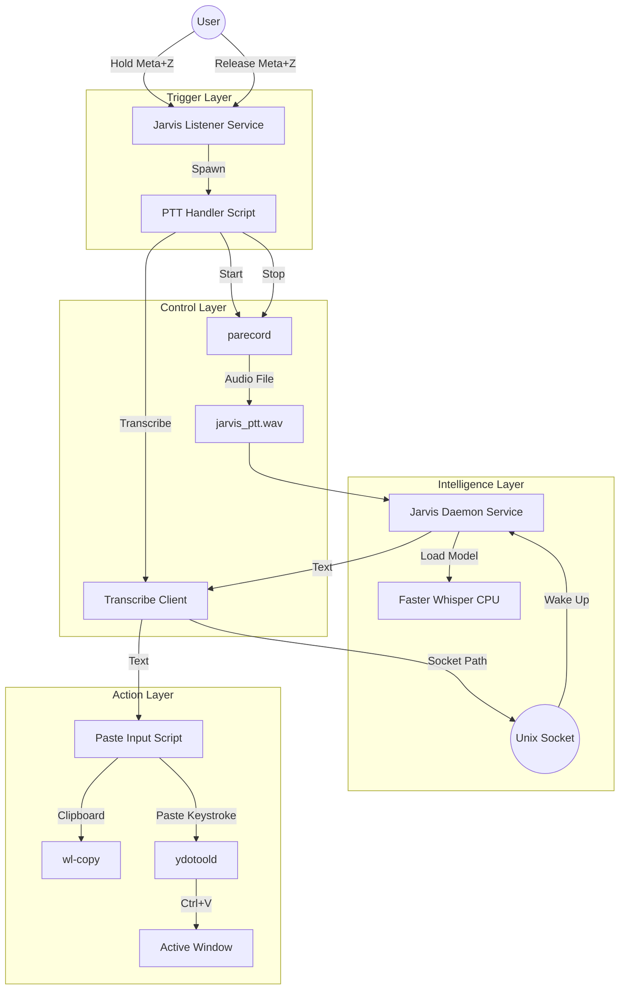

# Jarvis System Architecture

## Component Diagram



## Data Flow

```
[ Keyboard ] --> [ /dev/input ] --> [ jarvis_listener.py ]
                                           |
                                           v
                                  [ jarvis_ptt_handler.sh ]
                                         /   \
                                   Start/     \Stop
                                       v       v
                              [ parecord ]   [ transcribe.py ]
                                   |              |
                                   v              v (Unix Socket)
                         [ /tmp/jarvis.wav ] --> [ jarvis_daemon.py ]
                                                       |
                                                       v
                                              [ paste_input.py ]
                                                       |
                                                       v
                                              [ Active Window ]
```

## Components

| Component | File | Description |
|-----------|------|-------------|
| Listener | `scripts/jarvis_listener.py` | Monitors keyboard for Meta+Z hotkey |
| Handler | `scripts/jarvis_ptt_handler.sh` | Orchestrates recording and transcription |
| Daemon | `scripts/jarvis_daemon.py` | Holds Whisper model in memory, transcribes on demand |
| Transcriber | `scripts/transcribe.py` | Socket client that talks to daemon |
| Paster | `scripts/paste_input.py` | Injects text via clipboard (atomic) |
| Typer | `scripts/type_input.py` | Injects text via ydotool typing (character-by-character) |

## Why This Architecture?

1. **Pre-loaded Model**: The daemon keeps the Whisper model in RAM, eliminating ~3s cold-start latency.

2. **Socket Activation**: Systemd can start the daemon on-demand when the socket is accessed.

3. **Clipboard Injection**: Using wl-copy + Ctrl+V is atomic and instant, vs typing which is slow and can be interrupted.

4. **Separation of Concerns**: The listener handles input detection, handler manages the workflow, daemon does AI inference.

## Benchmarks

Run the benchmark script to measure daemon latency:

```bash
python scripts/benchmark_daemon.py
```

Typical performance (CPU, int8 quantization):
- ~500-1000ms for 2-5 seconds of audio
- Model: `Systran/faster-distil-whisper-small.en`
